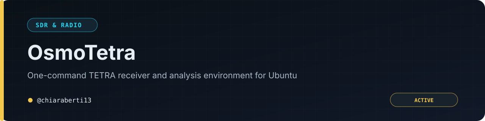

# 📡 OsmoTetra

<p align="center">
  <a href="README.md">🇬🇧 English</a> | <a href="README-IT.md">🇮🇹 Italiano</a>
</p>

<p align="center">
  
</p>

<p align="center">
  <b>Ricevitore TETRA per Ubuntu — installazione in un comando, avvio in un clic.</b>
</p>

<p align="center">
  <a href="https://github.com/chiaraberti13/OsmoTetraUbuntu/stargazers"></a>
  <a href="https://github.com/chiaraberti13/OsmoTetraUbuntu/network/members"></a>
  <a href="https://github.com/chiaraberti13/OsmoTetraUbuntu/issues"></a>
  <a href="LICENSE"></a>
</p>

<p align="center">
  <b>Software libero e gratuito (GPL-3.0-or-later). Non può essere rivenduto né ridistribuito come prodotto chiuso a pagamento.</b>
</p>

---

## Indice rapido

- **[Cosa fa OsmoTetra](#cosa-fa-osmotetra)** — cos'è OsmoTetra e come funziona la catena, in breve
- **[Avvertenze, responsabilità e licenza](#avvertenze-responsabilità-e-licenza)** — decifratura a chiave nota, responsabilità dell'uso, licenza GPL spiegata in parole semplici
- **[Requisiti](#requisiti)** — cosa serve prima di installare
- **[Installazione e primo avvio (passo passo)](#installazione-e-primo-avvio-passo-passo)** — dall'Ubuntu appena installato al primo canale ricevuto, 8 passi
- **[Elenco dei comandi](#elenco-dei-comandi)** — il comando `osmotetra` e tutte le sue varianti
- **[Legenda del pannello (voce per voce)](#legenda-del-pannello-voce-per-voce)** — ogni scheda del pannello, ogni campo, spiegato uno per uno
- **[Legenda dell'editor delle chiavi](#legenda-delleditor-delle-chiavi)** — ogni campo dell'editor grafico delle chiavi di decifratura
- **[Legenda della finestra dello spettro](#legenda-della-finestra-dello-spettro)** — ogni controllo della finestra dello spettro (inclusi quelli standard di GNU Radio)
- **[GNU Radio Companion (schema a blocchi)](#gnu-radio-companion-schema-a-blocchi)** — lo schema a blocchi originale, di sola consultazione
- **[I tasti di telive](#i-tasti-di-telive)** — i tasti da usare dentro il monitor `telive`
- **[Chiavetta in una macchina virtuale](#chiavetta-in-una-macchina-virtuale)** — come usare la chiavetta quando Ubuntu gira in una VM
- **[Se qualcosa non va](#se-qualcosa-non-va)** — gli errori più comuni e come risolverli
- **[Disinstallazione](#disinstallazione)** — come rimuovere OsmoTetra dal sistema

> [!TIP]
> **Prima volta qui?** Vai direttamente a [installazione e primo avvio](#installazione-e-primo-avvio-passo-passo)
> — una guida in 8 passi pensata per chi non ha mai usato OsmoTetra prima.

---

## Cosa fa OsmoTetra

OsmoTetra prende la catena di monitoraggio TETRA di **Jacek Lipkowski SQ5BPF**
(`osmo-tetra-sq5bpf-2` + codec vocale ETSI + `telive-2`) — normalmente fatta di
tre programmi da avviare a mano in tre terminali, con parametri da ricordare a
memoria — e la trasforma in un'app con un **pannello grafico unico**:
imposti frequenza e guadagno, premi un pulsante, e la catena parte da sola.

In breve, questo è quello che succede quando premi «Avvia»:

```
 RTL-SDR ─► flowgraph GNU Radio (osmotetra_rx.py)
              │        └─► finestra spettro (opzionale): 2 grafici + controlli
              │  campioni IQ a 36 kS/s
              ▼  UDP :42001
         receiver1udp  =  socat │ simdemod3_telive.py │ tetra-rx
              │  frame decodificati
              ▼  UDP :7379
           telive  ◄── il monitor che guardi: reti, SSI, chiamate (ncurses)
```

Non devi capire questo schema per usare l'app — è qui solo per chi è curioso
di sapere cosa succede sotto al pannello. Quello che vedrai in pratica sono
alcune **finestre** che si aprono da sole (pannello, schema GNU Radio,
spettro, telive): tutte spiegate voce per voce più avanti in questa guida.

Questa guida è pensata per chi non ha mai usato OsmoTetra (o TETRA in
generale): segue l'ordine — installazione, primo avvio, elenco comandi,
legenda completa di ogni scheda e ogni campo — così puoi seguirla dall'inizio
alla fine senza dover già sapere nulla.

## Avvertenze, responsabilità e licenza

> [!IMPORTANT]
> **Decifratura — solo a chiave nota.** La decifratura vocale funziona **solo
> se fornisci tu una chiave che già possiedi legittimamente**: il software non
> rompe, forza o aggira alcuna cifratura. Senza la chiave giusta, le chiamate
> cifrate restano semplicemente mute. `telive-2` (da cui questa parte deriva)
> è software sperimentale, pubblicato apertamente dall'autore originale.

> [!WARNING]
> **Responsabilità dell'uso.** Usa questo software solo per ricevere e
> decifrare traffico che **sei autorizzato** a ricevere e decifrare — reti di
> tua proprietà, banchi di prova, attività di ricerca autorizzata. In molti
> Paesi l'ascolto di trasmissioni radio non destinate a te è regolamentato o
> vietato: verifica le leggi applicabili nella tua giurisdizione prima di
> usare l'app. La responsabilità di un uso conforme alla legge è interamente
> di chi usa il software, non degli autori.

> [!NOTE]
> **Software libero e gratuito.** OsmoTetra è distribuito sotto licenza
> **GPL-3.0-or-later** (testo completo in [`LICENSE`](LICENSE)), la stessa dei
> progetti upstream (`osmo-tetra-sq5bpf-2`, `telive-2`) su cui si basa. In
> pratica, in parole semplici:
> - Puoi **usarlo, studiarlo e modificarlo liberamente**, per qualunque scopo.
> - Se **ridistribuisci** il software — modificato o no — devi farlo **sotto
>   la stessa licenza GPL**, con il codice sorgente disponibile: non puoi
>   trasformarlo in un prodotto chiuso.
> - **Non può essere venduto come prodotto proprietario né ridistribuito a
>   pagamento** spacciandolo per software commerciale chiuso: resta libero e
>   gratuito per chiunque lo riceva, in ogni copia successiva.
> - È fornito **così com'è, senza alcuna garanzia** (né di funzionamento, né di
>   idoneità a uno scopo particolare): lo standard di qualunque software
>   libero. Vedi `LICENSE` per il testo legale completo, che prevale su questo
>   riassunto in caso di conflitto.

## Requisiti

- **Ubuntu 24.04 o successive** (testato anche su 25.10, x86 e ARM64).
- Una **RTL-SDR** (o altra radio supportata da gr-osmosdr: HackRF, Airspy…).
- Un'antenna adatta alla banda TETRA che vuoi ricevere.
- Una connessione Internet per l'installazione (scarica ~1-2 GB fra
  dipendenze e sorgenti da compilare).

## Installazione e primo avvio (passo passo)

Questa sezione ti porta, un passo alla volta, da un Ubuntu appena installato
a un ricevitore TETRA funzionante. Non serve alcuna esperienza precedente.

**Passo 1 — Scarica e installa.**

Apri un terminale (cerca «Terminale» nel menu applicazioni, oppure
`Ctrl+Alt+T`) e incolla:

```bash
git clone https://github.com/chiaraberti13/OsmoTetraUbuntu.git
cd OsmoTetraUbuntu
./install.sh
```

Lancialo **da utente normale** (non con `sudo`: lo script chiede la password
da solo, solo quando serve, per `apt` e per creare la cartella `/tetra`).
Lo script:

1. installa tutte le dipendenze di sistema (GNU Radio, driver RTL-SDR,
   librerie…);
2. scarica e compila `osmo-tetra-sq5bpf-2` (il decodificatore), il codec
   vocale ETSI e `telive-2` (il monitor);
3. crea il comando `osmotetra` e la voce **«OsmoTetra»** nel menu
   applicazioni.

Ci mette qualche minuto (di più se compili su una scheda ARM64 poco
potente). **Non tocca la radio**: puoi installare anche senza avere ancora
la chiavetta collegata — serve solo quando userai l'app, non durante
l'installazione.

Se qualcosa va storto durante l'installazione, lo script si ferma con un
messaggio che spiega cosa è successo; il log completo resta in
`~/telive2/logs/install.log` per confrontarlo o allegarlo se chiedi aiuto.

**Passo 2 — Riapri il terminale.**

Il comando `osmotetra` viene aggiunto al tuo `PATH` (l'elenco di cartelle in
cui il sistema cerca i comandi): perché il terminale se ne accorga, **chiudi
e riapri il terminale**, oppure esegui `source ~/.bashrc` in quello già
aperto.

**Passo 3 — Collega l'hardware.**

Collega la chiavetta RTL-SDR a una porta USB del PC e avvita l'**antenna**
sulla chiavetta (senza antenna non riceverai nulla di utile).

**Passo 4 — Apri OsmoTetra.**

Due modi equivalenti:
- cerca **«OsmoTetra»** nel menu applicazioni e fai clic;
- oppure apri un terminale e scrivi `osmotetra`.

Si apre il **pannello**: è la finestra principale, quella da cui parte tutto.

**Passo 5 — Imposta i parametri.**

Nel pannello, scheda **Ricezione** (si apre già selezionata):

- **Frequenza del canale** — la frequenza del canale di controllo TETRA che
  vuoi ascoltare, in MHz (es. `390.5`). Se non la conosci, chiedi a chi
  gestisce la rete che vuoi monitorare, oppure usa lo spettro (vedi più
  avanti) per individuare le portanti attive. Scrivi **solo** la frequenza
  del canale: l'app tiene da sola l'SDR sintonizzato 500 kHz più in là
  (un accorgimento tecnico, l'«offset anti-DC», che allontana il segnale dal
  disturbo elettrico che ogni chiavetta RTL-SDR genera esattamente al centro
  della sua banda).
- **Guadagno RF** — quanto amplificare il segnale ricevuto, in dB. Il valore
  di partenza (`38`) va bene per la maggior parte delle chiavette; se non
  ricevi nulla, prova ad alzarlo, se il segnale è distorto/rumoroso prova ad
  abbassarlo.
- **Sorgente SDR** — lascia **«Chiavetta locale (USB)»** se la chiavetta è
  collegata direttamente a questo PC. (Se invece la usi da dentro una
  macchina virtuale, vedi la sezione **«Chiavetta in una macchina virtuale»**
  più avanti.)

Tutti gli altri campi hanno un valore di default sensato: non serve
toccarli al primo avvio. Se vuoi capire cosa fa ciascuno nel dettaglio, la
**legenda completa** (qui sotto) descrive ogni singolo campo del pannello.

**Passo 6 — Avvia.**

Premi il pulsante **«▶ Avvia»**. Si aprono, in sequenza:

1. **GNU Radio Companion**, con lo schema a blocchi del ricevitore già
   disegnato — puoi lasciarlo pure in secondo piano, è solo una finestra di
   consultazione (spiegata più avanti);
2. la **finestra dello spettro** — due grafici che mostrano il segnale radio
   in arrivo;
3. **`telive`** — il monitor vero e proprio, in un terminale a schermo
   pieno.

**Passo 7 — Verifica che stai ricevendo.**

Torna al pannello e apri la scheda **Stato**: entro pochi secondi le sei
righe passano da `·` (grigio, «non ancora noto») a **✓** (verde, «tutto a
posto»). In particolare, quando la riga **«Rete rilevata»** mostra qualcosa
come `MCC 222 · MNC 55 · CC 30 · ↓ 390.5000 MHz`, stai ricevendo davvero la
rete TETRA.

Puoi controllare anche direttamente in **`telive`**: in alto compaiono
**`MCC`**, **`MNC`** e le frequenze (es. `MCC: 222 MNC: 55 …
Control:390.5000MHz`) al posto degli zeri iniziali. Le chiamate che passano
sul canale compaiono nell'elenco principale e nella finestra dei messaggi in
basso.

Non vedi nulla dopo un minuto? Vai alla sezione **«Se qualcosa non va»** più
in basso: il pannello Stato ti dice già a che punto si è fermata la catena.

**Passo 8 — Ferma.**

Quando hai finito, premi **«■ Ferma»** nel pannello (oppure premi `q` dentro
`telive`): tutta la catena si chiude in ordine, comprese le finestre aperte
automaticamente.

## Elenco dei comandi

Tutto quello che puoi fare da terminale passa dal comando `osmotetra`. Ogni
riga della tabella corrisponde a una finestra o a un'azione; l'ordine va dal
«pezzo singolo» più piccolo fino a «tutto insieme»:

| Comando | Cosa fa |
|---|---|
| `osmotetra` | apre il **pannello** grafico — il modo consigliato per iniziare |
| `osmotetra grc` | apre **solo** GNU Radio Companion, con lo schema a blocchi |
| `osmotetra spettro 390.5` | apre **solo** la finestra dello spettro, sul canale indicato (per guardare/sintonizzare senza avviare il resto) |
| `osmotetra monitor 390.5` | avvia ricevitore + telive, **senza** aprire lo spettro |
| `osmotetra avvia 390.5` | avvia **tutto insieme**: schema a blocchi + ricevitore + spettro + telive |
| `osmotetra chiavi` | apre **solo** l'editor delle chiavi di decifratura |
| `osmotetra stop` | ferma tutta la catena, qualunque cosa fosse in esecuzione |
| `osmotetra aiuto` | stampa questo stesso elenco nel terminale |

Dove il comando accetta una frequenza (`spettro`, `monitor`, `avvia`), è
sempre in **MHz** e **facoltativa**: se la ometti, l'app usa il valore che
avevi lasciato nel pannello (o `390.5` la primissima volta). Dopo la
frequenza puoi anche indicare il dispositivo SDR da usare, ad esempio:

```bash
osmotetra avvia 390.5 rtl=0                          # prima chiavetta collegata
osmotetra avvia 390.5 rtl_tcp=192.168.64.1:1234      # chiavetta via rete (VM)
```

**Variabili d'ambiente (uso avanzato da terminale).** Se lanci la catena da
`avvia.sh` invece che dal pannello, alcuni dettagli sono regolabili con
variabili d'ambiente, da anteporre al comando:

| Variabile | A cosa serve | Default |
|---|---|---|
| `OSMOTETRA_HOME` | dove si trovano i sorgenti compilati | `~/telive2` |
| `OSMOTETRA_GAIN` | guadagno RF in dB | `38` |
| `OSMOTETRA_PPM` | correzione di frequenza in ppm | `0` |
| `OSMOTETRA_NOGUI` | se valorizzata, non apre mai la finestra dello spettro | (spenta) |
| `OSMOTETRA_NOGRC` | se valorizzata, non apre mai GNU Radio Companion | (spenta) |
| `OSMOTETRA_LANG` | lingua del pannello: `it` oppure `en` | `it` |
| `OSMOTETRA_PYTHON` | interprete Python con i binding GNU Radio | `python3` |

Esempio: `OSMOTETRA_NOGRC=1 osmotetra avvia 390.5` avvia tutto **tranne**
GNU Radio Companion, una volta sola, senza cambiare le impostazioni salvate.

## Legenda del pannello (voce per voce)

Questa sezione descrive **ogni singolo elemento** del pannello principale:
non dovrebbe mancarne nessuno. Usala come riferimento quando non sei sicuro
di cosa faccia un campo.

### Barra superiore (sempre visibile)

Questi elementi restano in vista qualunque scheda tu abbia aperta:

| Elemento | Cosa fa |
|---|---|
| **Modalità** | selettore **Base** / **Avanzata**. In **Base** vedi solo l'essenziale; in **Avanzata** compaiono anche la scheda **Avanzate**, la correzione ppm e il campo dispositivo manuale. Cambia in qualunque momento, anche a catena ferma. |
| **Lingua** | selettore **Italiano** / **English**: cambia la lingua di tutto il pannello (e dei messaggi diagnostici del flowgraph). Cambiandola, l'app **si riavvia da sola** per applicarla (fermando prima la ricezione, se era in corso); la scelta resta salvata per le volte successive. |
| **▶ Avvia** | avvia l'intera catena con i parametri impostati nella scheda Ricezione. Disabilitato mentre la catena è già in esecuzione. |
| **■ Ferma** | ferma tutta la catena (flowgraph, ricevitore, telive) in ordine. Disabilitato quando non c'è nulla in esecuzione. |
| **◆ Chiavi di decifratura…** | apre l'editor delle chiavi (vedi la sezione dedicata più avanti). Disponibile sia a catena ferma sia in esecuzione. |
| **Barra di stato** (striscia colorata sotto i pulsanti) | riassume lo stato in una parola: **grigia** «Fermo», **gialla** «Avvio in corso…», **verde** «In esecuzione — guarda la finestra di telive». |

### Scheda «Ricezione»

Quello che serve per partire, più i profili salvati.

| Campo | Cosa fa |
|---|---|
| **Frequenza del canale** | la frequenza (MHz) del canale di controllo TETRA da ascoltare. Ha una freccetta che si muove di 25 kHz per volta (il passo dei canali TETRA); se scrivi un valore che cade fuori da questo reticolo, sotto il campo compare un avviso con il canale valido più vicino. |
| **Guadagno RF** | amplificazione del segnale ricevuto, in dB (0–50). Default `38`. |
| **Sorgente SDR** | **Chiavetta locale (USB)** se la radio è collegata a questo PC; **Chiavetta remota (rete / VM)** se è su un'altra macchina raggiungibile in rete (tipicamente: dentro una macchina virtuale). |
| **Indirizzo remoto** (IP / porta) | compare solo se «Sorgente SDR» è impostata su remota: l'indirizzo IP e la porta del servizio `rtl_tcp` che espone la chiavetta in rete. Vedi «Chiavetta in una macchina virtuale». |
| **Mostra la finestra dello spettro (grafici + controlli)** | casella, spuntata di default. Se spuntata, «Avvia» apre anche la finestra dello spettro; se la togli, quella finestra non si apre (utile se vuoi solo `telive` in primo piano). |
| **Apri anche GNU Radio Companion (schema a blocchi)** | casella, spuntata di default (se il file dello schema è presente). Se spuntata, «Avvia» apre anche GNU Radio Companion col diagramma a blocchi del ricevitore, di sola consultazione. Vedi la sezione dedicata. |
| **Profili → menu a tendina** | elenco dei profili salvati (nome libero, scelto da te). Selezionandone uno, i campi sopra si riempiono con i valori salvati in quel profilo. |
| **Profili → «Salva come…»** | salva i valori attuali (frequenza, guadagno, sorgente, ecc.) come nuovo profilo, o aggiorna uno esistente se usi lo stesso nome. Chiede il nome con una finestrella. I profili **non contengono mai chiavi di decifratura**. |
| **Profili → «Elimina»** | rimuove il profilo selezionato nel menu a tendina, dopo conferma. |

### Scheda «Stato»

Sei righe che riassumono a colpo d'occhio a che punto è la catena. Ogni riga
ha un simbolo (**✓** verde = a posto, **!** ambra = manca qualcosa, **·**
grigio = non ancora noto) e passando il mouse sopra compare la spiegazione
estesa.

| Riga | Cosa significa **✓** | Cosa significa **!** |
|---|---|---|
| **Ricevitore SDR** | la radio è aperta e il flowgraph gira | — (se non è verde, guarda i log: la radio probabilmente non si è aperta) |
| **Segnale in arrivo** | il decoder riceve campioni dalla radio e misura lo scostamento di frequenza | nessun campione: controlla frequenza, guadagno o antenna scollegata |
| **Sincronizzazione TETRA** | il decoder ha agganciato la struttura delle trame ed è su un vero canale di controllo | non agganciato: sei forse su un canale che non è di controllo, o il segnale è troppo debole |
| **Rete rilevata** | mostra `MCC · MNC · CC · LA · ↓ frequenza` letti dai messaggi della cella | nessuna rete letta finora |
| **Traffico cifrato** | il traffico che senti è in chiaro | il traffico è cifrato — via etere si sa *che* lo è, non *con quale* algoritmo (vedi il riquadro sotto) |
| **Chiavi configurate** | quante chiavi ci sono nel keyfile e per quale rete, con l'algoritmo scelto | — (mostra sempre lo stato, anche a catena ferma) |

> [!IMPORTANT]
> **Attenzione a cosa dice davvero la radio.** Via etere TETRA segnala **se**
> il traffico è cifrato, **non quale algoritmo** usa. L'algoritmo
> (`TEA1`…`TEA7`) è un'informazione che **devi conoscere tu** (dalla rete o
> dal banco di prova) e che scegli nell'editor delle chiavi — il pannello non
> può indovinarlo.

### Scheda «Rete»

I dati della cella che stai ascoltando, letti dai messaggi di rete non
appena la ricezione aggancia il canale. Ogni campo ha un **`?`** su cui
passare il mouse per la spiegazione estesa.

| Campo | Cosa mostra |
|---|---|
| **MCC (Paese)** | *Mobile Country Code*: il Paese della rete (es. `222` = Italia). |
| **MNC (rete)** | *Mobile Network Code*: quale rete, dentro quel Paese. |
| **Codice colore (CC)** | *Colour Code*: distingue celle vicine sulla stessa frequenza; se cambia mentre ascolti, ti sei spostato su un'altra cella. |
| **Area di localizzazione (LA)** | *Location Area*: il gruppo di celle in cui i terminali sono registrati. |
| **Frequenza di discesa** | la frequenza del canale di controllo in discesa (dalla rete verso i terminali) — quella che stai ascoltando. |
| **Cifratura** | se il traffico attuale è cifrato o in chiaro (vedi la nota sulla scheda Stato). |
| **Ultimo aggiornamento** | l'orario dell'ultimo messaggio di rete ricevuto. |

Sotto ai campi, il pulsante **«▸ Copia dettagli rete»** copia un riassunto
in testo semplice di tutti i valori sopra negli appunti, pronto da incollare
altrove (una nota, una email…).

### Scheda «Chiavi»

Un riepilogo di sola lettura di cosa c'è nel keyfile: quante chiavi, per
quale rete, con quale algoritmo. Il pulsante **«◆ Apri l'editor delle
chiavi…»** apre l'editor grafico completo (descritto nella sezione
successiva). Sotto compare anche il percorso del file sul disco.

### Scheda «Log»

| Elemento | Cosa fa |
|---|---|
| **Log tecnico (mostra tutto)** | casella, spenta di default. Da spenta, il log mostra solo i messaggi pensati per te (avvio, arresto, errori). Da accesa, mostra anche l'output grezzo di flowgraph e ricevitore — utile da copiare quando chiedi aiuto. Puoi accenderla/spegnerla in ogni momento senza perdere nulla di ciò che è già passato. |
| **▪ Esporta diagnostica…** | salva su file un rapporto di testo con versioni di sistema, impostazioni correnti, componenti installati, stato, dati di rete e le ultime righe di log — **senza alcuna chiave**: del keyfile riporta solo quante chiavi ci sono e per quale rete, e ogni sequenza che somiglia a una chiave viene rimossa dal log. Pensato per essere allegato quando chiedi aiuto. |
| **Riquadro del log** | il testo vero e proprio, aggiornato in tempo reale. |

### Scheda «Avanzate» (solo in modalità Avanzata)

Compare solo se **Modalità** è impostata su **Avanzata**; in **Base**
sparisce del tutto.

| Campo | Cosa fa |
|---|---|
| **Correzione (ppm)** | correzione fine della frequenza, in parti per milione, per compensare la deriva dell'oscillatore della chiavetta. Parti da `0`; se in `telive` l'AFC è lontano da zero (vedi «I tasti di telive»), ritocca questo valore. |
| **Dispositivo (manuale)** | campo libero (con alcuni preset già pronti nel menu a tendina) per una stringa `gr-osmosdr` scritta a mano, ad es. `rtl=0`, `hackrf=0`, `rtl_tcp=IP:porta`. Se lo lasci vuoto, vale la scelta fatta in «Sorgente SDR» nella scheda Ricezione. |
| **«Dove sono le cose»** | un riepilogo di sola lettura dei percorsi usati dall'app: sorgenti e binari, decoder, monitor telive, keyfile, interprete Python con GNU Radio, e le porte di rete usate internamente. Utile per il debug o per chi vuole curiosare nei file. |

## Legenda dell'editor delle chiavi

L'editor si apre col pulsante **«◆ Chiavi di decifratura…»** nel pannello,
dalla scheda **Chiavi**, oppure da terminale con `osmotetra chiavi`. Serve a
scrivere il keyfile che usa il decoder **senza dover modificare un file di
testo a mano**. Parte in **modalità guidata**: i campi tecnici avanzati sono
nascosti finché non li richiami esplicitamente.

### Sezione «Rete»

| Campo | Cosa fa |
|---|---|
| **MCC** | il codice del Paese della rete (es. `222`). Viene completato da solo a 4 cifre quando esci dal campo (`222` → `0222`): è il formato che il keyfile richiede. |
| **MNC** | il codice della rete dentro quel Paese (es. `55`), completato a 4 cifre allo stesso modo. |
| **↧ Usa rete rilevata** | pulsante che compila MCC e MNC al posto tuo, con i valori letti dall'aria durante la ricezione. **Attivo solo dopo** che il pannello Stato ha mostrato «Rete rilevata»: se non l'hai ancora vista, il pulsante resta disabilitato con una spiegazione nel tooltip. |
| **Algoritmo (ksg_type)** | menu a tendina `TEA1`…`TEA7`. **Scegli l'algoritmo che sai essere usato dalla tua rete o dal tuo banco di prova — mai «a occhio» in base al Paese**: via etere TETRA segnala solo *se* il traffico è cifrato, non *quale* algoritmo usa. |
| **Classe di sicurezza** | `2` (SCK, chiave statica) oppure `3` (CCK+DCK, chiavi derivate). Se non sai quale scegliere, chiedi a chi gestisce la rete. |

### Sezione «Chiavi» (tabella)

| Colonna | Cosa contiene |
|---|---|
| **Tipo di chiave** | quale ruolo ha la chiave: di solito `1` (CCK/SCK); `16` è per una chiave TEA1 accorciata a 32 bit. Le altre voci (`2` DCK, `4` MGCK, `8` GCK) sono per casi più specifici. |
| **Chiave (80 bit hex)** | il valore della chiave, in cifre esadecimali (`0`-`9`, `a`-`f`): 20 cifre = 80 bit, il formato standard. Per il tipo `16` (TEA1 a 32 bit) inserisci le 8 cifre e riempi il resto con zeri fino a 20 (es. `12345678` diventa `12345678000000000000`). Il campo è mascherato come una password; vedi la casella «Mostra chiavi» per rivelarlo. |
| **MCC / MNC** *(colonne avanzate)* | rete specifica per questa singola chiave, se diversa da quella impostata sopra. Lasciale vuote per usare i valori della sezione Rete. |
| **addr** *(colonna avanzata)* | indirizzo associato alla chiave (8 cifre); `00000000` va bene nella maggior parte dei casi. |
| **key_num** *(colonna avanzata)* | numero progressivo della chiave, quando la rete ne usa più di una dello stesso tipo. |

Sopra la tabella:

| Elemento | Cosa fa |
|---|---|
| **+ Aggiungi chiave** | aggiunge una riga vuota alla tabella. |
| **− Rimuovi selezionata** | rimuove la riga attualmente selezionata. |
| **Mostra chiavi** | casella: se spuntata, il testo delle chiavi diventa leggibile invece che mascherato — utile per ricontrollare quanto scritto prima di salvare. |
| **Parametri avanzati ▼** | casella: mostra/nasconde le colonne tecniche (MCC, MNC, addr, key_num) per singola chiave. Spenta di default: nella maggior parte dei casi bastano Tipo e Chiave. |

### Pulsanti in basso

| Pulsante | Cosa fa |
|---|---|
| **▸ Mostra file generato** | apre un'anteprima di sola lettura di esattamente ciò che l'editor scriverà nel keyfile (le righe `network …` e `key …`) — senza salvare nulla. Utile per capire il formato o per confrontare con un keyfile scritto a mano. |
| **Ricarica dal file** | scarta le modifiche non salvate e ricarica i campi dal keyfile su disco. |
| **▪ Salva** | valida i campi (avvisa se una chiave non è esadecimale o non è lunga 20 cifre), mostra un riepilogo (rete, algoritmo, numero di chiavi, percorso del file) e, dopo conferma, scrive il keyfile con permessi riservati al tuo utente (`0600` — nessun altro utente del PC può leggerlo). |
| **Chiudi** | chiude l'editor. Le modifiche non salvate vengono perse. |

> [!NOTE]
> Senza chiavi (o con la sola chiave d'esempio che arriva con l'installazione)
> sentirai **solo le chiamate in chiaro**; quelle cifrate restano mute. È il
> comportamento atteso, non un errore.

## Legenda della finestra dello spettro

Si apre insieme al resto con «Avvia» (se la casella nella scheda Ricezione è
spuntata), da sola con `osmotetra spettro 390.5`, oppure premendo «Avvia»
con la casella tolta e poi riaprendola in un secondo momento con lo stesso
comando. È lo stesso pannello del flowgraph originale di SQ5BPF, con in più
i comandi standard di GNU Radio per i due grafici.

**Controlli in alto (a caldo — l'effetto è immediato):**

| Elemento | Cosa fa |
|---|---|
| **Frequenza canale** | mostra/permette di cambiare la frequenza del canale che stai ascoltando (es. `390.5M`). |
| **Fine tune** | ritocco fine della sintonia in kHz, con cursore o casella numerica. |
| **ppm** | correzione della frequenza, equivalente al campo «Correzione (ppm)» del pannello. |
| **gain** | guadagno RF, equivalente al campo «Guadagno RF» del pannello. |

**I due grafici:**

| Grafico | Cosa mostra |
|---|---|
| **Sinistro (banda intera)** | lo spettro completo della banda campionata (2 MHz): ci vedi il segnale TETRA e i canali vicini, utile per trovare la portante giusta. |
| **IF (destro)** | il singolo canale dopo il filtro (~62,5 kHz di banda): utile per centrare bene la sintonia — la forma «a tetto piatto» larga circa 25 kHz è il segno di una portante TETRA. |

**Controlli standard di GNU Radio, a fianco di ciascun grafico** (uguali per
entrambi i grafici; non serve toccarli per ricevere, sono per chi vuole
analizzare lo spettro più a fondo):

| Elemento | Cosa fa |
|---|---|
| **Trace Options → Max Hold / Min Hold** | mostra il valore massimo/minimo osservato nel tempo per ogni frequenza, invece del valore istantaneo. |
| **Trace Options → Avg** | quanto mediare la visualizzazione nel tempo (più a destra = più stabile ma più lenta a reagire). |
| **Axis Options → Grid / Axis Labels** | mostra/nasconde la griglia e le etichette degli assi. |
| **Axis Options → Y Range (+/−) / Ref Level (+/−)** | regolano manualmente la scala verticale del grafico (in dB). |
| **Axis Options → Autoscale** | adatta automaticamente la scala verticale al segnale presente in quel momento. |
| **FFT → dimensione / finestra** | numero di punti della trasformata di Fourier e tipo di finestratura usati per calcolare lo spettro: valori più alti danno più dettaglio in frequenza ma aggiornano più lentamente. |
| **Trigger** | condizione per «congelare» il grafico su un evento (di default `Free`, cioè nessun trigger: il grafico scorre continuamente). |
| **Extras → Stop** | ferma l'aggiornamento di quel singolo grafico (non la ricezione). |

## GNU Radio Companion (schema a blocchi)

Oltre alle finestre già descritte, con **«▶ Avvia»** (o `osmotetra avvia`) si
apre anche **GNU Radio Companion**, il programma di GNU Radio con lo schema
a blocchi — sorgente SDR, filtro, AGC, ricampionatore, uscita UDP — già
disegnato e collegato, esattamente come nella versione originale della
catena SQ5BPF.

È **di sola consultazione**: la ricezione vera la fa già la parte automatica
(il flowgraph headless avviato dal pannello), quindi non c'è alcun conflitto
sulla chiavetta. Serve per vedere o modificare lo schema, capire come
funziona il flusso del segnale, o confrontare i parametri con quelli del
pannello.

**Per aprirlo da solo**, senza avviare il resto: `osmotetra grc`, oppure la
casella **«Apri anche GNU Radio Companion (schema a blocchi)»** nella scheda
*Ricezione* del pannello controlla se si apre insieme al resto (spuntata di
default, se il file dello schema è presente sul disco).

> [!CAUTION]
> Non premere **Execute** dentro GNU Radio Companion mentre la ricezione è
> già avviata dal pannello: proverebbe ad aprire la stessa chiavetta una
> seconda volta, e fallirebbe. Usalo per guardare e capire lo schema, non per
> farlo partire in parallelo alla ricezione automatica.

## I tasti di telive

L'interfaccia di `telive` resta quella originale, in ncurses (a schermo
pieno nel terminale). I tasti più usati:

| Tasto | Effetto |
|---|---|
| `?` | aiuto, elenco completo dei tasti disponibili |
| `t` | alterna finestra SSI / finestra delle frequenze (mostra l'**AFC**) |
| `R` | attiva/disattiva la registrazione delle chiamate |
| `l` | attiva/disattiva il log della segnalazione |
| `M` / `m` | silenzia tutto / silenzia solo gli SSI sconosciuti |
| `q` | esci da `telive` (ferma anche il resto della catena, se avviata dal pannello) |

**Correzione fine (ppm).** Premi `t` per aprire la finestra delle frequenze:
se il valore **AFC** mostrato è lontano da zero, ritocca il campo **ppm**
(nella finestra dello spettro o nella scheda Avanzate del pannello) finché
non si avvicina a zero — significa che l'oscillatore della chiavetta ha una
piccola deriva che stai compensando manualmente.

## Chiavetta in una macchina virtuale

Se Ubuntu gira in una macchina virtuale il cui hypervisor **non inoltra
l'USB** alla VM (capita ad esempio con le VM di Apple Virtualization su
Mac), la chiavetta collegata al computer fisico non è visibile da dentro la
VM. La soluzione è lasciare la chiavetta al **sistema ospitante** (il Mac o
PC fisico) ed esporla in rete verso la VM:

1. Sul sistema **ospitante** (non nella VM), installa e avvia `rtl_tcp`:
   ```bash
   rtl_tcp -a 0.0.0.0 -p 1234
   ```
   e lascia quella finestra aperta per tutta la sessione.
2. Nella VM, nel pannello OsmoTetra, scheda Ricezione, imposta **Sorgente
   SDR** = **«Chiavetta remota (rete / VM)»**.
3. Compila **Indirizzo remoto**: l'**IP dell'host** (visibile dalla VM — per
   le VM di Apple Virtualization è tipicamente `192.168.64.1`) e la
   **porta** `1234`.

L'app costruisce da sola la stringa tecnica necessaria
(`rtl_tcp=192.168.64.1:1234`): non devi scriverla a mano.

## Se qualcosa non va

- **«Nessun dispositivo SDR trovato»** — la chiavetta non è vista dal
  sistema. Controlla con `rtl_test -t`. Se compare
  `usb_claim_interface error -6`, il driver DVB-T generico è ancora
  caricato: scollega/ricollega la chiavetta o riavvia il PC. In una VM, usa
  `rtl_tcp` (vedi sopra).
- **«rtl_tcp non risponde»** — sul sistema ospitante il comando `rtl_tcp` non
  è in esecuzione, oppure un firewall blocca la porta `1234`.
- **`telive` si apre ma l'intestazione resta a zero** — guarda prima il
  riquadro **Stato** nel pannello: ti dice se manca il **segnale**
  (frequenza sbagliata, guadagno troppo basso, antenna scollegata) o solo la
  **sincronizzazione** (quel canale non è di controllo, o non c'è copertura
  di rete in quel punto). Poi guarda lo spettro (`osmotetra spettro 390.5`):
  il segnale TETRA deve essere ben visibile e ben centrato nel grafico IF.
- **Le chiamate cifrate restano mute** — normale senza le chiavi giuste:
  aprile con `osmotetra chiavi` e inserisci le tue.
- **GNU Radio Companion non si apre** — verifica che `gnuradio-companion`
  sia installato (`which gnuradio-companion`): fa parte del pacchetto
  `gnuradio` che `install.sh` installa già, quindi di norma basta rilanciare
  `./install.sh`. Se non ti serve, togli la spunta nella scheda *Ricezione*
  oppure esporta `OSMOTETRA_NOGRC=1` prima di `avvia.sh`.
- **La build di telive fallisce su nanohttp** — succede solo su libxml2 ≥
  2.14 (Ubuntu 25.10 e successive); l'installer applica da solo la patch che
  lo risolve, non serve intervenire a mano.
- **Devi chiedere aiuto?** Nel pannello, scheda **Log**, spunta **«Log
  tecnico (mostra tutto)»** e copia quello che compare, oppure usa **«▪
  Esporta diagnostica…»** per un file completo pronto da allegare (non
  contiene mai chiavi).

Tutti i log restano comunque salvati in `~/telive2/logs/`.

## Disinstallazione

```bash
./uninstall.sh          # conserva registrazioni e log
./uninstall.sh --purge  # rimuove tutto, compresa /tetra
```

---

## Crediti

- **Jacek Lipkowski SQ5BPF** — [osmo-tetra-sq5bpf-2](https://github.com/sq5bpf/osmo-tetra-sq5bpf-2)
  e [telive-2](https://github.com/sq5bpf/telive-2), la catena di ricezione e decodifica.
  `osmotetra_rx.grc` (lo schema in GNU Radio Companion) è il file originale
  dell'autore, incluso invariato da telive-2.
- Progetto originale osmo-tetra di **Harald Welte** e collaboratori.
- Codec vocale **ETSI** EN 300 395-2.

## Licenza

OsmoTetra è distribuito sotto **GPL-3.0-or-later** (vedi [`LICENSE`](LICENSE)),
come i sorgenti di upstream su cui si basa. È software **libero e gratuito**:
puoi usarlo, studiarlo e modificarlo, ma non rivenderlo né ridistribuirlo come
prodotto chiuso a pagamento — ogni copia, anche modificata, resta libera per
chi la riceve.

---

<p align="center">
  <sub>Basato sulla catena di monitoraggio TETRA di <a href="https://github.com/sq5bpf">Jacek Lipkowski SQ5BPF</a></sub>
</p>
